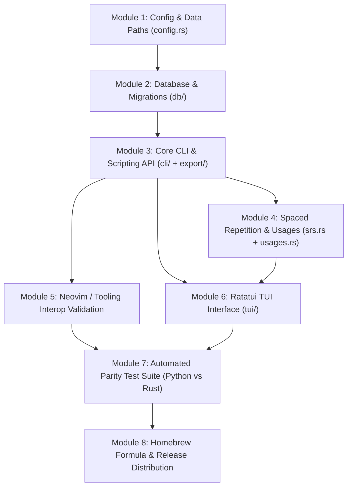

# CPKB Rust Migration Plan & Architecture Specification

## Overview & Goal
This document specifies the step-by-step roadmap to transition **CPKB** from Python (Textual + Click/Argparse + SQLite) to **Rust** (Ratatui + Clap + Rusqlite + Syntect).

The Python implementation will remain untouched and fully operational as the ground truth until the Rust implementation matches 100% functional, structural, and test parity.

---

## 1. Prerequisites, Tools & Toolchain Setup

### Required Tools to Install
Ensure you have the modern Rust toolchain installed:
```bash
# 1. Install Rust via rustup (if not already installed)
curl --proto '=https' --tlsv1.2 -sSf https://sh.rustup.rs | sh
rustup default stable
rustup update

# 2. Recommended Cargo extensions for fast local development
cargo install cargo-watch      # Auto-run tests/lints on file changes
cargo install cargo-nextest    # Faster, prettier test execution
cargo install cargo-audit      # Security vulnerability scanning
cargo install cargo-edit       # Manage dependencies from CLI (cargo add/rm)
```

### Essential Concepts & Crates Used
| Domain | Python Equivalent | Selected Rust Crate | Why This Choice |
| :--- | :--- | :--- | :--- |
| **CLI Parser** | `argparse` | [`clap`](https://crates.io/crates/clap) `4.x` (derive) | Type-safe CLI definition, auto-generates `--help` and shell completions. |
| **Database** | `sqlite3` | [`rusqlite`](https://crates.io/crates/rusqlite) (`bundled`) | Embeds SQLite directly, zero runtime dependencies on system SQLite libraries. |
| **TUI Interface** | `textual` | [`ratatui`](https://crates.io/crates/ratatui) + [`crossterm`](https://crates.io/crates/crossterm) | Industry standard for terminal UIs, sub-millisecond rendering. |
| **Text Area** | `textual.TextArea` | [`tui-textarea`](https://crates.io/crates/tui-textarea) | Multi-line text input widget with cursor handling for Ratatui. |
| **Syntax Highlighting**| `rich.syntax` | [`syntect`](https://crates.io/crates/syntect) | Sublime Text syntax highlighting engine for previews in TUI and export. |
| **Clipboard** | `subprocess` (`pbcopy`) | [`arboard`](https://crates.io/crates/arboard) | Native cross-platform clipboard without spawning external shell processes. |
| **Serialization** | `json` | [`serde`](https://crates.io/crates/serde) + [`serde_json`](https://crates.io/crates/serde_json) | High performance compile-time serialization/deserialization. |
| **Date & Time** | `datetime` | [`chrono`](https://crates.io/crates/chrono) (`serde`) | ISO-8601 formatting, timestamps, and SM-2 date calculations. |
| **Fuzzy Matching** | `re` / `fzf` | [`fuzzy-matcher`](https://crates.io/crates/fuzzy-matcher) / [`nucleo`](https://crates.io/crates/nucleo) | Fast in-process fuzzy search matching fzf behavior. |
| **Interactive Prompts**| `input()` | [`inquire`](https://crates.io/crates/inquire) or [`dialoguer`](https://crates.io/crates/dialoguer) | Clean CLI interactive select, text, and confirm prompts. |
| **Crypto / Encryption**| `cryptography` | [`aes-gcm`](https://crates.io/crates/aes-gcm) / [`fernet`](https://crates.io/crates/fernet) + [`pbkdf2`](https://crates.io/crates/pbkdf2) | Full compatibility with current database encryption format. |

---

## 2. Target Project Architecture

We will structure the Rust project as a single crate with clear, decoupled modules (or a Cargo Workspace if needed later):

```
cpkb-rs/ (or rust/ in repository root)
├── Cargo.toml
├── src/
│   ├── main.rs                  # Binary entry point & CLI subcommand routing
│   ├── config.rs                # Configuration loading, defaults, and paths (~/.local/share/cpkb)
│   ├── db/
│   │   ├── mod.rs               # Connection lifecycle & schema migrations (v1 -> v2 -> v3)
│   │   ├── schema.rs            # Table definitions (snippets, usages, tags, reviews, schema_meta)
│   │   ├── snippets.rs          # Snippet CRUD operations & sequential ID generator
│   │   ├── search.rs            # Multi-keyword AND search & query formatters
│   │   ├── usages.rs            # Problem usage tracking
│   │   ├── srs.rs               # SuperMemo SM-2 Spaced Repetition engine
│   │   └── backup.rs            # Timestamped database snapshot & pruning
│   ├── cli/
│   │   ├── mod.rs               # Clap CLI argument definitions
│   │   ├── commands/            # Handlers for add, show, list, query, export, import, etc.
│   │   ├── prompt.rs            # Interactive input & $EDITOR buffer invocation
│   │   └── completions.rs       # Shell completion script generators
│   ├── tui/
│   │   ├── mod.rs               # Ratatui application entry loop & crossterm event handling
│   │   ├── app.rs               # App state machine (current view, selected index, modals)
│   │   ├── ui.rs                # Main layout rendering (left snippet list, right preview)
│   │   ├── theme.rs             # Cosmere & custom RGB theme engine
│   │   ├── badges.rs            # Language icons & badges (󰌷 C++,  Py, 󰙩 TeX,  MD, etc.)
│   │   └── modals/              # Add, Edit, Delete, Usage, Settings, Filter, Help modals
│   ├── export/
│   │   ├── markdown.rs          # Markdown exporter with language codeblocks
│   │   ├── json.rs              # JSON metadata exporter
│   │   ├── html.rs              # HTML report exporter
│   │   └── import.rs            # Importer (JSON, MD, HTML, DB, bundled cheatsheets)
│   ├── crypto.rs                # PBKDF2-HMAC-SHA256 & Fernet database encryption/decryption
│   ├── clipboard.rs             # Cross-platform clipboard writer
│   └── defaults.rs              # Bundled standard C++ & Markdown cheatsheets
└── tests/
    ├── test_db.rs               # SQLite CRUD & migration integration tests
    ├── test_cli.rs              # CLI command execution & JSON output parity tests
    └── test_srs.rs              # SM-2 interval & ease-factor calculation tests
```

---

## 3. Modular Step-by-Step Implementation Roadmap



---

### Module 1: Configuration & Storage Paths (`config.rs`)
- **Goal**: Replicate `load_config`, `save_config`, default fallback merging, and path resolution for `~/.local/share/cpkb/`.
- **Reference**: [`KNOWLEDGE_BASE.md`](file:///Users/aaravshah2975/cpkb/KNOWLEDGE_BASE.md#L41-L50) & [`src/cpkb/config.py`](file:///Users/aaravshah2975/cpkb/src/cpkb/config.py).
- **Key Rust Types**:
  ```rust
  #[derive(Debug, Serialize, Deserialize, Clone)]
  pub struct Config {
      pub config_version: u32,
      pub app_version: String,
      pub default_language: String,
      pub editor: EditorConfig,
      pub display: DisplayConfig,
      pub snippets: SnippetsConfig,
      pub backups: BackupsConfig,
      pub keybindings: KeybindingsConfig,
      pub encryption: EncryptionConfig,
  }
  ```
- **Validation**: Verify that loading an existing `config.json` written by Python results in a matching struct in Rust.

---

### Module 2: Database Schema & Migration Engine (`db/`)
- **Goal**: Ensure 100% compatibility with SQLite Schema v3.
- **Reference**: [`KNOWLEDGE_BASE.md`](file:///Users/aaravshah2975/cpkb/KNOWLEDGE_BASE.md#L51-L85) & [`src/cpkb/db.py`](file:///Users/aaravshah2975/cpkb/src/cpkb/db.py).
- **Key Deliverables**:
  1. `get_conn()` enabling `PRAGMA foreign_keys = ON;`.
  2. `migrate_db()` detecting legacy schemas (v0, v1, v2) and safely upgrading to v3 with `language` column and automatic backup (`cpkb.db.v2.bak`).
  3. Sequential ID generator supporting pattern syntax (`CP#####`, `ms_#####`, `LATEX-######`, `ALG.######`, `ID@#######`).
  4. Auto-detection for LaTeX/TeX snippets (`id_format == "latex"` or `id.starts_with("LATEX")` $\to$ `language = "tex"`).

---

### Module 3: Core CLI Subcommands & JSON API (`cli/` + `export/`)
- **Goal**: Implement all essential CLI commands with Clap v4.
- **Reference**: [`KNOWLEDGE_BASE.md`](file:///Users/aaravshah2975/cpkb/KNOWLEDGE_BASE.md#L103-L139).
- **Subcommands**:
  - `cpkb add [-l LANG] [--id-format FORMAT]` (interactive input or $EDITOR markdown buffer).
  - `cpkb show <id> [--json]` (exact JSON contract for editor plugins).
  - `cpkb list` & `cpkb recent [-n LIMIT]`.
  - `cpkb search <query>` (AND search across title, description, tags, code).
  - `cpkb query <query> [--limit N]` (`id | title` piped output).
  - `cpkb edit <id>` (spawn `$EDITOR` with Markdown header + code separator `---`).
  - `cpkb delete <id>` (cascade deletion).
  - `cpkb export` / `export-json` / `export-html` / `export-db`.
  - `cpkb import [source] [--format ...] [--defaults] [--regenerate-ids]`.
  - `cpkb copy <id> [-f FILE]`.

---

### Module 4: Spaced Repetition (SM-2) & Usages
- **Goal**: Implement SuperMemo SM-2 review scheduler and problem usage tracker.
- **Reference**: [`KNOWLEDGE_BASE.md`](file:///Users/aaravshah2975/cpkb/KNOWLEDGE_BASE.md#L86-L102).
- **Key Deliverables**:
  - `get_due_snippet`, `get_unreviewed_snippet`, `get_random_snippet`.
  - `upsert_review(snippet_id, quality: 0..=5)` calculating new `ease_factor`, `interval`, and `next_review` timestamp.
  - `cpkb revise` interactive review session.
  - `cpkb srs-stats` metrics calculation.
  - `cpkb use <id> <file>`, `cpkb usages <id>`, `cpkb edit-usage <id>`.

---

### Module 5: Neovim & External Integration Verification
- **Goal**: Verify that the compiled Rust binary seamlessly drops into existing user environments.
- **Integration Points**:
  1. **Neovim Telescope (`telescope/_extensions/cpkb.lua`)**:
     - `cpkb query '' --limit 1000` returns pipe-delimited list.
     - `cpkb show <id> --json` returns valid JSON payload containing `"language"`, `"code"`, `"title"`, etc.
  2. **Neovim Add Plugin (`cpkb/add.lua`)**:
     - `cpkb import <tmp_json> --format json` successfully imports newly captured snippet from visual selection or yank buffer.
  3. **Performance Metric**: Subcommand round-trip execution in Neovim drops from ~80ms to <4ms.

---

### Module 6: High-Performance Ratatui TUI (`tui/`)
- **Goal**: Recreate the full Textual TUI experience in Ratatui with sub-millisecond response time.
- **Reference**: [`KNOWLEDGE_BASE.md`](file:///Users/aaravshah2975/cpkb/KNOWLEDGE_BASE.md#L140-L168) & [`src/cpkb/tui.py`](file:///Users/aaravshah2975/cpkb/src/cpkb/tui.py).
- **Features & Components**:
  - **Layout**: Dual-pane view (left snippet list with dynamic width `[` / `]`, right detail preview with `syntect` syntax highlighting).
  - **Badges**: Developer icons (`󰌷 C++`, ` Py`, ` Rs`, `󰙩 TeX`, ` JS`, ` TS`, `󰟓 Go`, ` Lua`, `󰘐 Java`, ` Sh`, ` MD`, `󰉿 Txt`, `󰆼 SQL`).
  - **Modals**:
    - `AddSnippetModal` & `EditSnippetModal` (Title, Description, Use Case, Tags, Language Select dropdown, Code Editor).
    - `TagFilterModal` (`f` key).
    - `SettingsModal` (`ctrl+,` key for theme, accents, border style, layout).
    - `DeleteConfirmModal` (`ctrl+d`).
    - `HelpModal` (`?` key).
  - **Themes**: Support built-in themes (`textual-dark`, `dracula`, `nord`, `monokai`, `gruvbox`, `tokyo-night`) and user Cosmere colors (`~/.local/bin/cosmere_colors.sh`).

---

### Module 7: Parity Verification & Testing
- **Strategy**: Run side-by-side automated comparisons between Python CPKB and Rust CPKB.
- **Verification Matrix**:
  - Database schema and row parity on identical databases.
  - JSON export parity (field names, types, timestamp formats).
  - Search query ranking and filter parity.
  - Spaced repetition SM-2 ease factor and interval math parity.

---

### Module 8: Homebrew Formula & Release Distribution
- **Goal**: Update the Homebrew distribution from Python formula to native Rust compiled binary.
- **Homebrew Formula Transition**:
  - **Current Python Formula**: Uses `virtualenv`, Python resources, and `entry_points`.
  - **Rust Formula (`cpkb.rb`)**:
    ```ruby
    class Cpkb < Formula
      desc "Competitive Programming Knowledge Base"
      homepage "https://github.com/Aaravshah2907/cpkb"
      url "https://github.com/Aaravshah2907/cpkb/archive/refs/tags/v3.0.0.tar.gz"
      sha256 "..."
      license "MIT"

      depends_on "rust" => :build

      def install
        system "cargo", "install", *std_cargo_args
      end

      test do
        assert_match "CPKB", shell_output("#{bin}/cpkb --version")
      end
    end
    ```
- **GitHub Actions CI/CD**: Auto-build binary tarballs for macOS (Apple Silicon `aarch64-apple-darwin` and Intel `x86_64-apple-darwin`) and Linux (`x86_64-unknown-linux-gnu`).

---

## 4. Master TODO & Progress Checklist

Use this interactive checklist to track progress throughout the migration:

- [ ] **Module 1: Config & Environment**
  - [ ] Initialize Cargo project (`Cargo.toml` with `clap`, `rusqlite`, `serde`, `chrono`, `ratatui`)
  - [ ] Implement `config.rs` (`load_config`, `save_config`, `DEFAULT_CONFIG`, path helpers)
  - [ ] Unit tests for config loading, serialization, and default merging

- [ ] **Module 2: Database Core & Schema v3**
  - [ ] Implement `db/schema.rs` (`snippets`, `usages`, `tags`, `reviews`, `schema_meta`)
  - [ ] Implement `db/mod.rs` (`get_conn`, `init_db`, `migrate_db` v0 $\to$ v3)
  - [ ] Implement `db/snippets.rs` (CRUD operations and sequential `generate_id`)
  - [ ] Auto-assign `language = "tex"` for LaTeX ID formats
  - [ ] Integration tests verifying database migration and ID generation

- [ ] **Module 3: CLI Subcommands & JSON API**
  - [ ] Set up `clap` derive parser for all 23+ subcommands with help descriptions
  - [ ] Implement `cmd_show` with `--json` output
  - [ ] Implement `cmd_query` (pipeline-friendly `id | title`)
  - [ ] Implement `cmd_list`, `cmd_recent`, and `cmd_search`
  - [ ] Implement `cmd_add` (interactive prompts & Markdown buffer editor)
  - [ ] Implement `cmd_edit` and `cmd_delete`
  - [ ] Implement `cmd_copy` with `arboard` clipboard integration
  - [ ] Implement `cmd_id_format` (`list`, `add`, `default`)
  - [ ] Implement `cmd_setup`, `cmd_backup`, `cmd_config`
  - [ ] Implement `cmd_install_completions` (bash, zsh, fish)

- [ ] **Module 4: Spaced Repetition & Usages**
  - [ ] Implement SM-2 algorithm calculations in `db/srs.rs`
  - [ ] Implement `cmd_revise` interactive flashcard CLI session
  - [ ] Implement `cmd_srs_stats`
  - [ ] Implement `cmd_use`, `cmd_usages`, `cmd_edit_usage`

- [ ] **Module 5: Import & Export Engine**
  - [ ] Implement Markdown exporter (`export/markdown.rs`)
  - [ ] Implement JSON exporter (`export/json.rs`)
  - [ ] Implement HTML exporter (`export/html.rs`)
  - [ ] Implement SQLite DB exporter with optional encryption (`crypto.rs`)
  - [ ] Implement multi-format importer (`export/import.rs`)
  - [ ] Embed bundled C++ STL & Markdown cheatsheets (`defaults.rs`)

- [ ] **Module 6: Ratatui TUI Interface**
  - [ ] Set up crossterm event loop and main app state machine
  - [ ] Build dual-pane layout (snippet list + code preview)
  - [ ] Integrate `syntect` syntax highlighting in code preview pane
  - [ ] Implement language badges and icons
  - [ ] Implement `/` search filter
  - [ ] Implement `AddSnippetModal` & `EditSnippetModal` with `tui-textarea`
  - [ ] Implement `TagFilterModal`, `SettingsModal`, `HelpModal`, `DeleteModal`
  - [ ] Support Cosmere colors and custom RGB themes

- [ ] **Module 7: Integration & Verification**
  - [ ] Verify Neovim Telescope picker (`<leader>cs`) with Rust binary
  - [ ] Verify Neovim visual snippet capture (`<leader>cv`) and yank capture (`<leader>cy`)
  - [ ] Run full automated test suite asserting output parity against Python CPKB

- [ ] **Module 8: Distribution & Homebrew Release**
  - [ ] Create GitHub Actions workflow for multi-platform binary compilation
  - [ ] Update Homebrew formula (`cpkb.rb`) to build with `cargo install`
  - [ ] Tag release `v3.0.0` and publish
